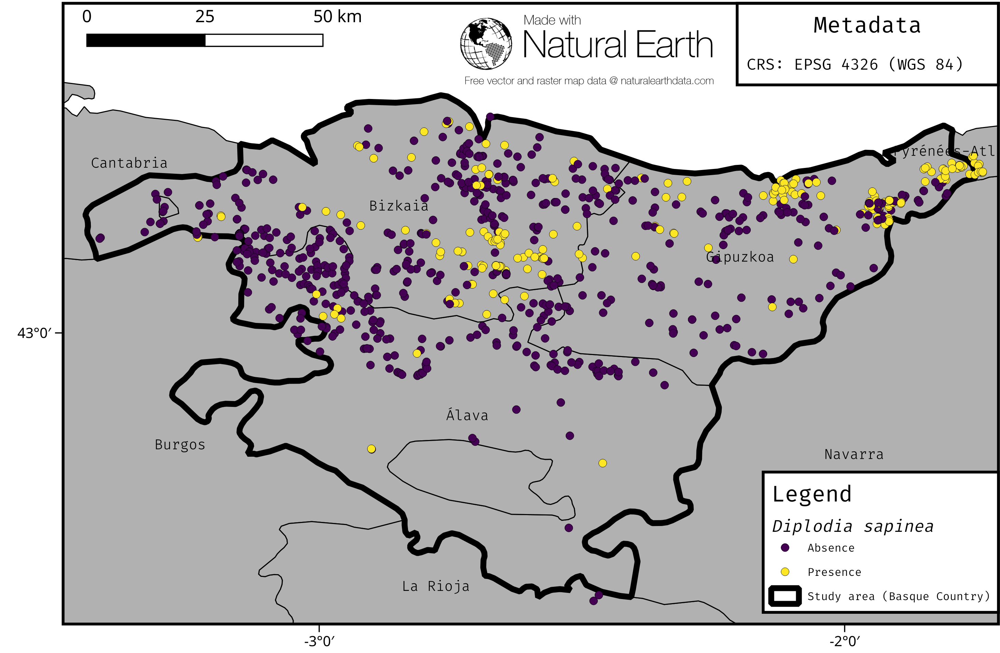
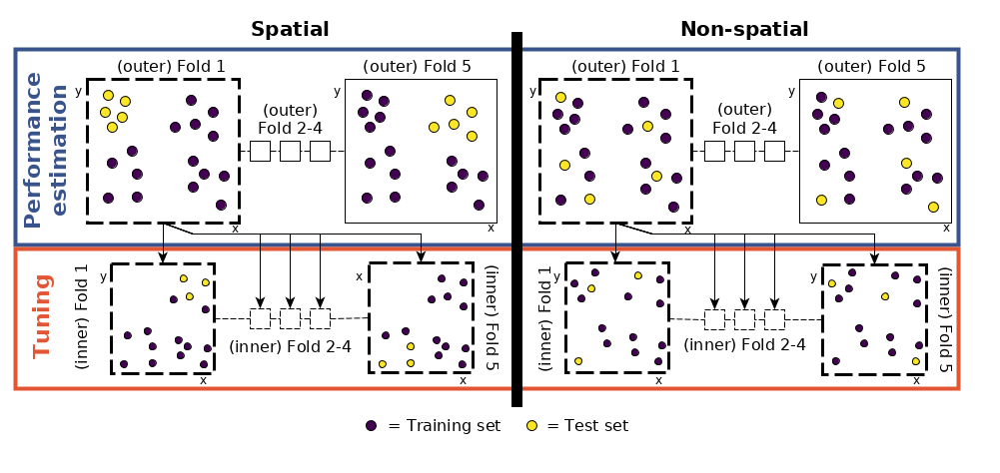

```{r setup, include=FALSE}
options(htmltools.dir.version = FALSE)
htmltools::tagList(rmarkdown::html_dependency_font_awesome())
htmltools::tagList(rmarkdown::html_dependency_ionicons())
icon_system_file <- function(file) {
  system.file(file, package = "icon")
}
htmltools::htmlDependency("academicons", "1.8.0", src = icon_system_file("fonts/academicons-1.8.0"),
      stylesheet = "css/academicons.min.css")
pacman::p_load(here, knitr, magrittr)
```

```{r, load_refs, echo=FALSE, cache=FALSE}
library(RefManageR)
BibOptions(check.entries = FALSE, 
           bib.style = "authoryear", 
           cite.style = 'authoryear', 
           style = "markdown",
           hyperlink = TRUE, 
           dashed = TRUE)
bib <- ReadBib("/home/patrick/PhD/papers/01_model_comparison/02_writing/submission/2/latex-source-files/Bibliography.bib", 
                 check = FALSE)
```


class: title-slide  

# Performance evaluation and hyperparameter tuning of statistical and machine-learning models using spatial data

<html><div style='float:left'></div><hr color='#EB811B' size=1px width=796px></html>

### Patrick Schratz<sup>1</sup>, Jannes Muenchow<sup>1</sup>, Jakob Richter<sup>2</sup>, Alexander Brenning<sup>1</sup>

<p style="margin-left:15px;">

<br>

Kolloquium (Institute of Statistics), Munich, 20 Jun 2018

<br><br>

<i class="fa fa-university"></i> <sup>1</sup> Department of Geography, GISciene group, University of Jena  <a href="http://www.geographie.uni-jena.de/en/Geoinformatik_p_1558.html"><i class="fa fa-external-link"></i></a> <br>

<i class="fa fa-university"></i> <sup>2</sup> Department of Statistics, TU Dortmund
<a href="https://www.statistik.tu-dortmund.de/aktuelles.html"><i class="fa fa-external-link"></i></a>
<br><br>

<i class="fa fa-home"></i> <a href="https://pat-s.github.io">https://pat-s.github.io</a> &emsp; 

<i class="fa fa-twitter"></i> <a href="https://twitter.com/pjs_228">@pjs_228</a> &emsp; 

<i class="fa fa-github"></i> <a href="https://github.com/pat-s">@pat-s</a> &emsp; 

<i class="fa fa-stack-exchange"></i> <a href="https://stackoverflow.com/users/4185785/pat-s">@pjs_228</a> &emsp;  <br>

<i class="fa fa-envelope"></i> <a href="patrick.schratz@uni-jena.de">patrick.schratz@uni-jena.de</a>&emsp;

<i class="fa fa-linkedin"></i> <a href="https://www.linkedin.com/in/patrick-schratz/">Patrick Schratz</a>&emsp;

</p>

<div class="my-header"></div> 

---

layout: true

<div class="my-header"></div>       

---


# Outline

.font150[
1. Introduction

2. Data and study area

3. Methods

4. Results

5. Discussion
]

---
class: inverse, center, middle

# Introduction

<html><div style='float:left'></div><hr color='#EB811B' size=1px width=720px></html> 

---

# Introduction

### \# Whoami

- "Data Scientist"
- Studied B.Sc. **Geography** & M.Sc. **Geoinformatics** at University of Jena
- Self-taught programmer
- Interested in model optimization, R package development, server administration

#### Contributions to `mlr`
- Integrated new sampling scheme for CV: Spatial sampling
- Redesigned the tutorial site (`mkdocs`-> `pkgdown`)
- Added getter for inner resampling indices
- more to come ;)

---

# Introduction

.pull-left[

### LIFE Healthy Forest <i class="fa fa-tree"></i>
 
Early detection and advanced management systems to reduce forest decline by invasive and pathogenic agents.

**Main task**: Spatial (modeling) analysis to support the early detection of various pathogens.

## Pathogens <i class="fa fa-bug"></i>

* Fusarium circinatum 
* **Diplodia sapinea** (<i class="fa fa-arrow-right"></i> needle blight)
* Armillaria root disease
* Heterobasidion annosum

]

.pull-right[

.center[
  
.font70[**Fig. 1:** Needle blight caused by **Diplodia pinea**]
]
]

---

# Introduction

## Motivation

* Find the model with the **highest predictive performance**.

* Results are assumed to be representative for data sets with similar predictors and different pathogens (response).

* Be aware of **spatial autocorrelation** <i class="fa fa-exclamation-triangle"></i>

* Analyze differences between spatial and non-spatial hyperparameter tuning (no research here yet!).

* Analyze differences in performance between algorithms and sampling schemes in CV (both performance estimation and hyperparameter tuning)

---
class: inverse, center, middle

# Data <i class="fa fa-database"></i> & Study Area <i class="fa fa-map"></i>

<html><div style='float:left'></div><hr color='#EB811B' size=1px width=720px></html>

---

# Data <i class="fa fa-database"></i> & Study Area <i class="fa fa-map"></i>

.code70[
```{r, echo = FALSE, results='markup'}
readRDS("/data/patrick/mod/survey_data/2009-2012/data-clean.rda") %>% 
  tibble::as_tibble() -> df
df$geometry <- NULL
df$id <- NULL
df$fus01 <- NULL
df$hail <- NULL 
df$x <- NULL
df$y <- NULL
skimr::skim_format(.levels = list(max_char = 4))
skimr::skim_with(numeric = list(sd = NULL, p25 = NULL, p75 = NULL, complete = NULL), 
                 factor = list(ordered = NULL, complete = NULL))
skimr::skim(df) %>% skimr::kable()
```
]

---

# Data <i class="fa fa-database"></i> & Study Area <i class="fa fa-map"></i>

.center[
  
.font70[**Fig. 2:** Study area (Basque Country, Spain)]
]

---
class: inverse, center, middle

# Methods <i class="fa fa-cogs"></i>

<html><div style='float:left'></div><hr color='#EB811B' size=1px width=720px></html> 

---

# Methods <i class="fa fa-cogs"></i>

## Machine-learning models

* Boosted Regression Trees (`BRT`)
* Random Forest (`RF`)
* Support Vector Machine (`SVM`)
* k-nearest Neighbor (`KNN`)

## Parametric models

* Generalized Addtitive Model (`GAM`)
* Generalized Linear Model (`GLM`)

## Performance Measure

Brier Score

---

# Methods <i class="fa fa-cogs"></i>

## Nested Cross-Validation

 * Cross-validation for **performance estimation** 

 * Cross-validation for **hyperparameter tuning** (sequential based model optimization) 
    
Different sampling strategies (Performance estimation/Tuning):

* Non-Spatial/Non-Spatial

* Spatial/Non-Spatial

* Spatial/Spatial

* Non-Spatial/No Tuning

* Spatial/No Tuning

---

# Methods <i class="fa fa-cogs"></i>

## Nested (spatial) cross-validation

.center[
  
.font70[**Fig. 3:** Nested spatial/non-spatial cross-validation]] 

---

# Methods <i class="fa fa-cogs"></i>

## Nested (spatial) cross-validation

<br>

.center[
  
.font70[**Fig. 4:** Comparison of spatial and non-spatial partitioning of the data set.]
]

---

# Methods <i class="fa fa-cogs"></i>

#### Hyperparameter tuning search spaces

RF : `r Citet(bib, "Probst2018b")`  
BRT, SVM, KNN: Self-defined limits based on evaluation of estimated hyperparameters

.center[
  
.font70[**Table 1:** Hyperparameter limits and types of each model.  
Notations of hyperparameters from the respective R packages were used.  
$p$ = Number of variables.]
]

---
class: inverse, center, middle

# Results <i class="fa fa-image"></i> 

<html><div style='float:left'></div><hr color='#EB811B' size=1px width=720px></html> 

---

# Results <i class="fa fa-image"></i> 

## Hyperparameter tuning

.center[ 
  
]
.font70[**Fig 4:** Hyperparameter tuning results of the spatial/spatial CV setting for BRT, WKNN, RF and SVM: Number of tuning iterations  
(1 iteration = 1 random hyperparameter setting)
vs. predictive performance (AUROC).
]

---

# Results <i class="fa fa-image"></i> (Predictive Performance)

.center[
  
]
.font70[**Fig 5:**  (Nested) CV estimates of model performance at the repetition level using 200 random search iterations. CV setting refers to perfomance estimation/hyperparameter tuning
of the respective (nested) CV, e.g. ”Spatial/Non-Spatial” means that spatial partitioning was
used for performance estimation and non-spatial partitioning for hyperparameter tuning.
]

---
class: inverse, center, middle

# Discussion <i class="fa fa-comments"></i>

<html><div style='float:left'></div><hr color='#EB811B' size=1px width=720px></html> 

---

# Discussion <i class="fa fa-comments"></i>

## Predictive performance

* `RF` and `GAM` showed the best predictive performance <i class="fa fa-trophy"></i>

--

* High bias in performance when using non-spatial CV

---

# Discussion <i class="fa fa-comments"></i> (Performance)

.center[
  
]
.font70[**Fig 6:**  (Nested) CV estimates of model performance at the repetition level using 200 random search iterations. CV setting refers to perfomance estimation/hyperparameter tuning
of the respective (nested) CV, e.g. ”Spatial/Non-Spatial” means that spatial partitioning was
used for performance estimation and non-spatial partitioning for hyperparameter tuning.
]

---

# Discussion <i class="fa fa-comments"></i>

## Predictive Performance

* `RF` and `GAM` showed the best predictive performance <i class="fa fa-trophy"></i>

* High bias in performance when using non-spatial CV

* Parametric models (`GLM`, `GAM`) show equally good performance estimates as the best ML algorithm (`RF`)

---

# Discussion <i class="fa fa-comments"></i>

### [Iturritxa et al. (2014)](http://onlinelibrary.wiley.com/doi/10.1111/ppa.12328/abstract)

GLM: 0.65 AUROC (without predictor `hail`) 

GLM: 0.96 AUROC (with predictor `hail`)

### This work

GLM: 0.66 AUROC (without predictor `hail_prob`) + slope, pH, lithology, soil

GLM: 0.694 (with predictor `hail_prob`) + slope, pH, lithology, soil

---

# Discussion <i class="fa fa-comments"></i>

## Hyperparameter tuning

* Saturates at 50 repetitions and has a small effect for `SVM` and `BRT` (arbitrary defaults).

--

* Almost no effect on predictive performance for WKNN and RF (reasonable defaults).

--

* Default hyperparameters of `RF` (and all other learners) are not suitable for spatial data 

---

# Discussion <i class="fa fa-comments"></i> (Tuning)


.font70[**Fig 7:** Best hyperparameter settings by fold (500 total) each estimated from 200 random search tuning iterations per fold using five-fold cross-validation. Split by spatial and non-spatial partitioning setup.
Red crosses indicate default hyperparameter values.
Black dots represent the winning hyperparameter setting out of each random search tuning of the respective fold.]

---

# Discussion <i class="fa fa-comments"></i>

## Hyperparameter tuning

* Saturates at ~ 50 repetitions and has a small effect for `SVM` and `BRT` (arbitrary defaults).

* Almost no effect for `WKNN` and `RF` (reasonable defaults).

* Default hyperparameters of `RF` (and all other learners) are not suitable for spatial data 
    
    * They **possibly** lead to biased performance estimates as they cause fitted models to make use of the remaining spatial autocorrelation in the data.
    * Meaningful default values (`RF`, `WKNN`) have been estimated on non-spatial data sets.

<i class="fa fa-exclamation-circle"></i> Always perform a spatial hyperparameter tuning for spatial data sets, even if it does not improve accuracy <i class="fa fa-exclamation-circle"></i>

---

# References <i class="fa fa-copy"></i>

<i class="fa fa-file-text-o" aria-hidden="true"></i>  Bergstra, J., & Bengio, Y. (2012). Random search for hyperparameter optimization. J. Mach. Learn. Res., 13, 281–305. URL: http://dl.acm.org/citation.cfm?id=2188385.2188395.

<i class="fa fa-file-text-o" aria-hidden="true"></i> Iturritxa, E., Mesanza, N., & Brenning, A. (2014). Spatial analysis of the risk of major forest diseases in Monterey pine plantations. Plant Pathology, 64, 880–889. doi:[10.1111/ppa.12328](http://onlinelibrary.wiley.com/doi/10.1111/ppa.12328/abstract).

```{r, results='asis', echo=FALSE}
PrintBibliography(bib)
```

---
class: inverse, center, middle

# Backup <i class="fa fa-plus-square"></i>

<html><div style='float:left'></div><hr color='#EB811B' size=1px width=720px></html> 

---

# Backup <i class="fa fa-plus-square"></i>

.center[

]

---

# Backup <i class="fa fa-plus-square"></i>

<br>

.center[

]
