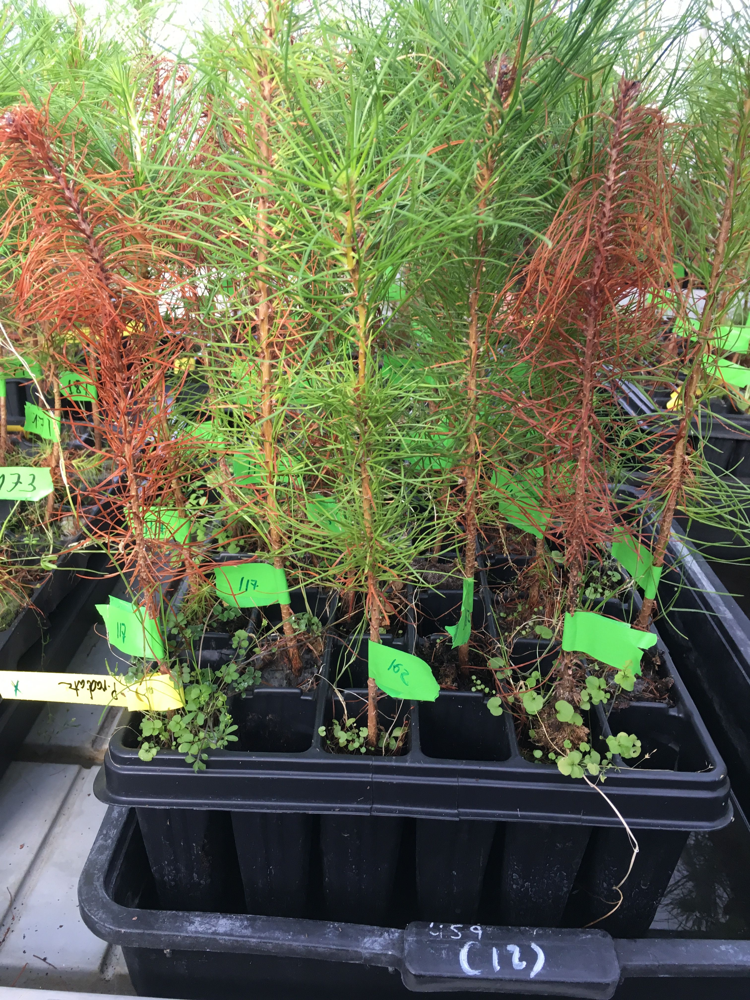
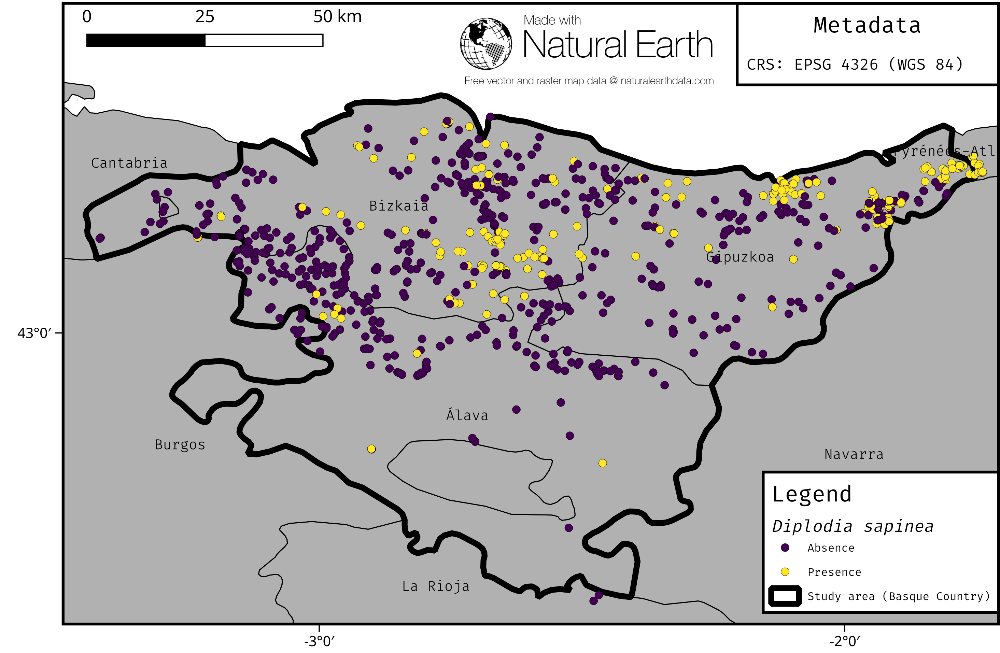
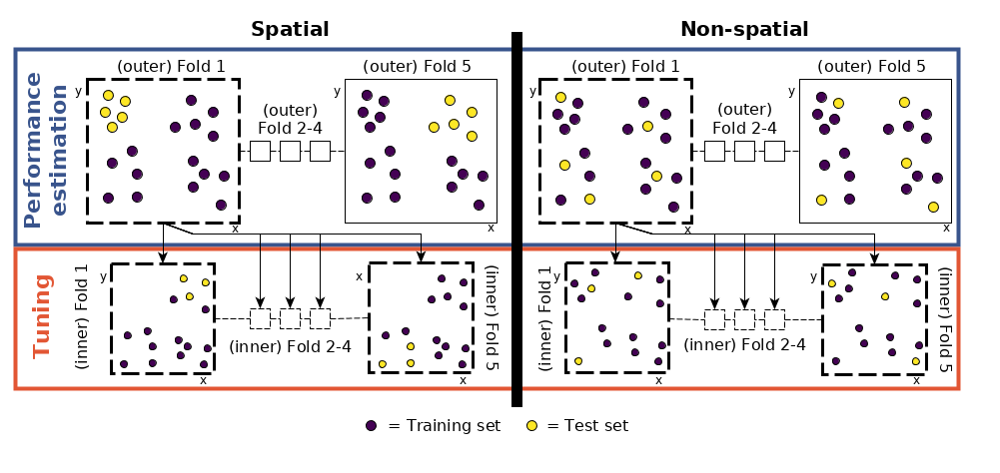
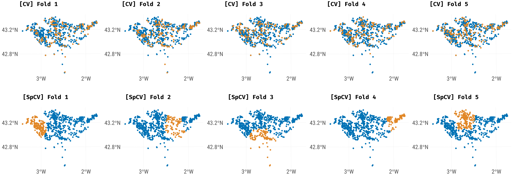
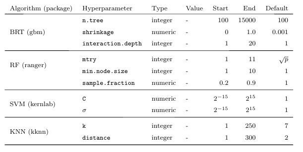
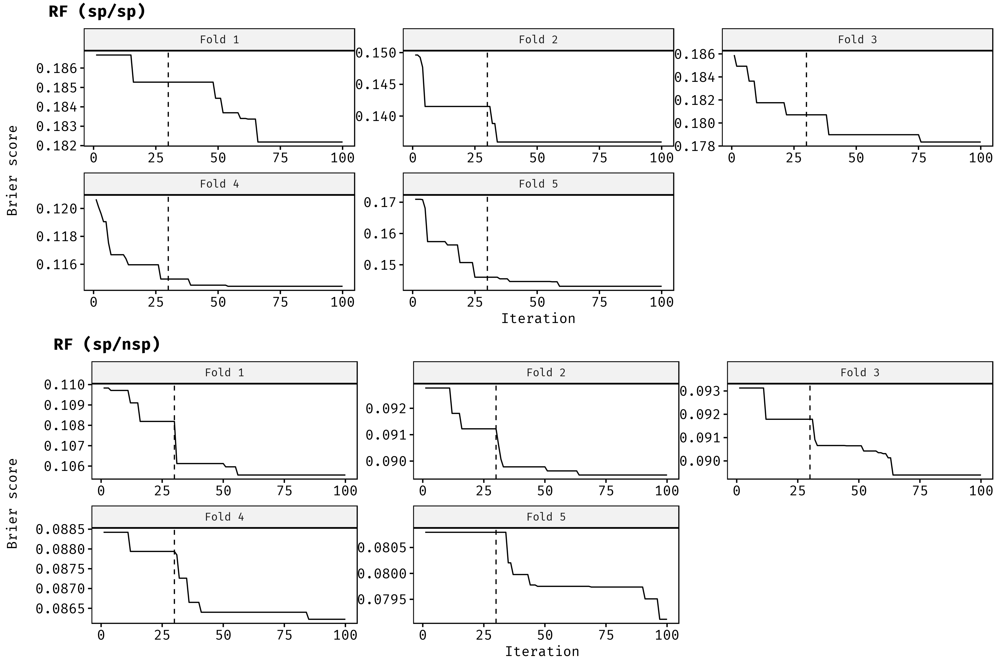
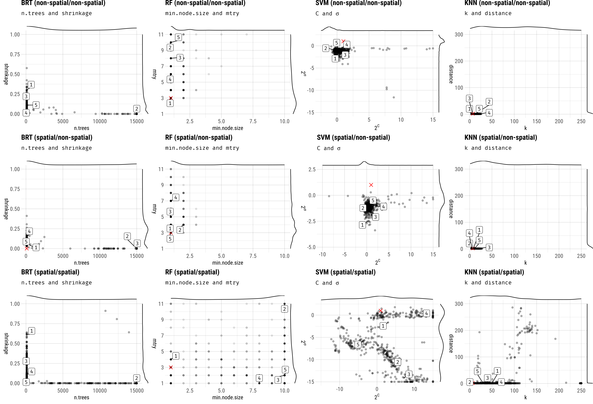
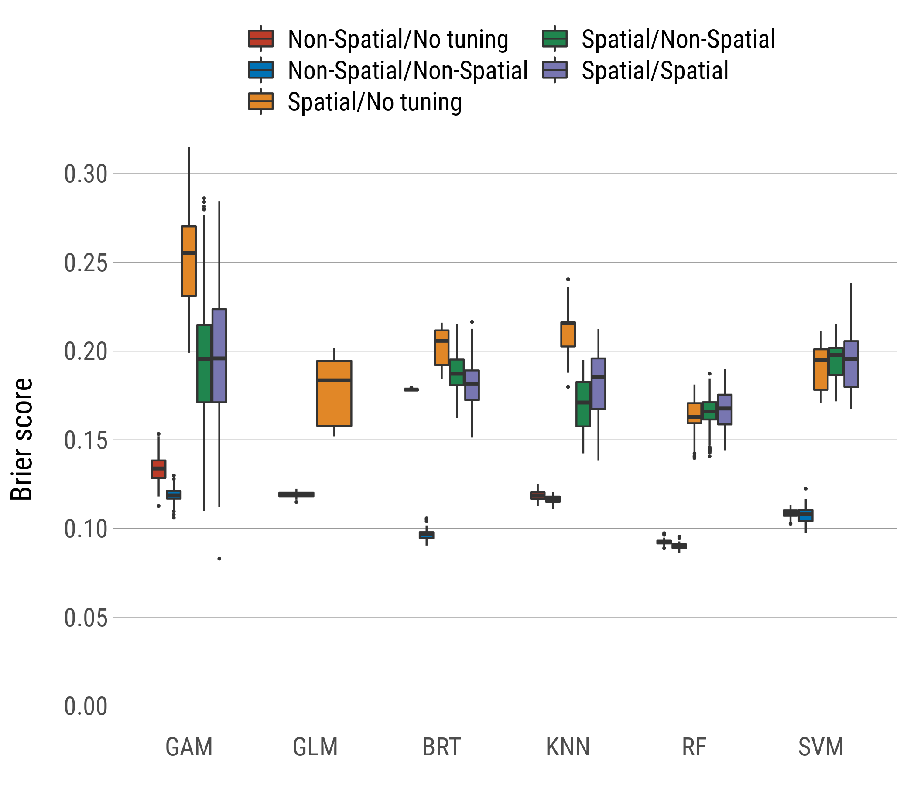
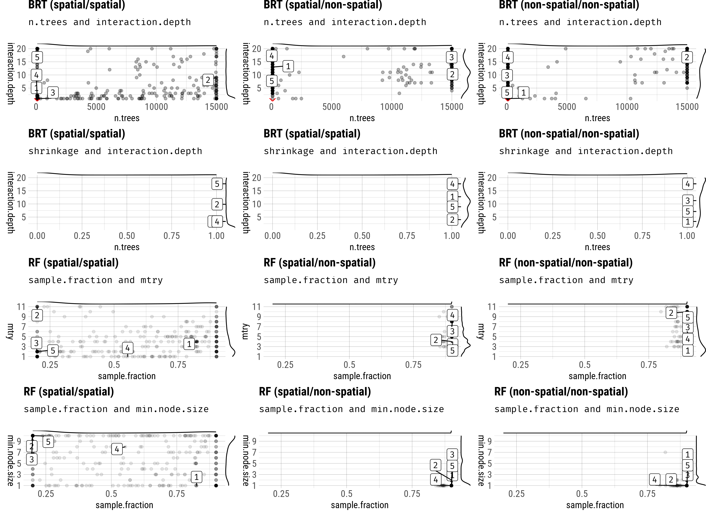

```{r setup, include=FALSE}
options(htmltools.dir.version = FALSE)
pacman::p_load(here, knitr, magrittr, icon)

# code output coloring
old.hooks = fansi::set_knit_hooks(knitr::knit_hooks)
options(crayon.enabled = TRUE)
```

```{r, load_refs, echo=FALSE, cache=FALSE}
library(RefManageR)
BibOptions(check.entries = FALSE, 
           bib.style = "authoryear", 
           cite.style = 'authoryear', 
           style = "markdown",
           hyperlink = FALSE, 
           dashed = TRUE)
# local
bib <- ReadBib("/mnt/mccoy/home/patrick/PhD/papers/01_model_comparison/02_writing/submission/2/latex-source-files/Bibliography.bib", 
                 check = FALSE)
# server
# bib <- ReadBib("/home/patrick/PhD/papers/01_model_comparison/02_writing/submission/2/latex-source-files/Bibliography.bib", 
#                  check = FALSE)
```

class: title-slide  

# The important role of spatial autocorrelation in hyperparameter tuning and predictive performance of machine-learning algorithms for spatial data

<html><div style='float:left'></div><hr color='#EB811B' size=1px width=796px></html>

### Patrick Schratz<sup>1</sup>, Jannes Muenchow<sup>1</sup>, Eugenia Iturritxa<sup>2</sup>, Jakob Richter<sup>3</sup>, Alexander Brenning<sup>1</sup>

<p style="margin-left:15px;">

<br>

`r fa_university()` <sup>1</sup> Department of Geography, GIScience group, University of Jena  <a href="http://www.geographie.uni-jena.de/en/Geoinformatik_p_1558.html">`r fa_external_link_alt()`</a>
<br>

`r fa_university()` <sup>2</sup> NEIKER, Vitoria-Gasteiz, Spain <a href="http://www.neiker.net/">`r fa_external_link_alt()`</a>
<br>

`r fa_university()` <sup>3</sup> Department of Statistics, TU Dortmund <a href="https://www.statistik.tu-dortmund.de/aktuelles.html">`r fa_external_link_alt()`</a>
<br><br>

`r fa_home()` <a href="https://pjs-web.de">https://pjs-web.de</a> &emsp; 

`r fa_twitter()` <a href="https://twitter.com/pjs_228">@pjs_228</a> &emsp; 

`r fa_github()` <a href="https://github.com/pat-s">@pat-s</a> &emsp; 

`r fa_stack_exchange()` <a href="https://stackoverflow.com/users/4185785/pat-s">@pjs_228</a> &emsp;  <br>

`r fa_envelope()` <a href="patrick.schratz@uni-jena.de">patrick.schratz@uni-jena.de</a>&emsp;

`r fa_linkedin()` <a href="https://www.linkedin.com/in/patrick-schratz/">Patrick Schratz</a>&emsp;

</p>

<div class="my-header"></div> 

---

layout: true

<div class="my-header"></div>       

---


# Outline

.pull-left[
.font150[
1. Introduction

2. Data and study area

3. Methods

4. Results

5. Discussion
]]

.pull-right[
<blockquote class="twitter-tweet" data-lang="en"><p lang="en" dir="ltr">Slides of my upcoming talk at LMU Munich on Jun 20th: <a href="https://t.co/SyWRky6sGn">https://t.co/SyWRky6sGn</a></p>&mdash; Patrick Schratz (@pjs_228) <a href="https://twitter.com/pjs_228/status/1008803282029088774?ref_src=twsrc%5Etfw">June 18, 2018</a></blockquote>
<script async src="https://platform.twitter.com/widgets.js" charset="utf-8"></script>
]

---
class: inverse, center, middle

# Introduction

<html><div style='float:left'></div><hr color='#EB811B' size=1px width=720px></html> 

---

# Introduction

#### \# Whoami

- "Data Scientist/Analyst"
- B.Sc. **Geography** & M.Sc. **Geoinformatics** at University of Jena
- Self-taught programmer
- Interested in model optimization, R package development, server administration
- Arch Linux package maintainer
- PhD student (since 2016)

#### Contributions to `mlr`
- Integrated new sampling scheme for CV: Spatial sampling
- Redesigned the tutorial site (`mkdocs`-> `pkgdown`)
- Added getter for inner resampling indices
- more to come ;)

---

# Introduction

.pull-left[

### LIFE Healthy Forest `r fa_tree()`

Early detection and advanced management systems to reduce forest decline by invasive and pathogenic agents.

**Main task**: Spatial (modeling) analysis to support the early detection of various pathogens.

## Pathogens `r fa_bug()`

* Fusarium circinatum 
* **Diplodia sapinea** (`r fa_arrow_right()` needle blight)
* Armillaria root disease
* Heterobasidion annosum

]

.pull-right[

.center[
  
.font70[**Fig. 1:** Needle blight caused by **Diplodia pinea**]
]
]

---

# Introduction

## Motivation

* Find the model with the **highest predictive performance**.

* Results are assumed to be representative for data sets with similar predictors and different pathogens (response).

* Be aware of **spatial autocorrelation** `r fa_exclamation_triangle()`

* Analyze differences between spatial and non-spatial hyperparameter tuning (no research here yet!).

* Analyze differences in performance between algorithms and sampling schemes in CV (both performance estimation and hyperparameter tuning)

---
class: inverse, center, middle

# Data `r fa_database()` & Study Area `r fa_map()`

<html><div style='float:left'></div><hr color='#EB811B' size=1px width=720px></html>

---

# Data `r fa_database()` & Study Area `r fa_map()`

.code70[
```{r, echo = FALSE, results='markup'}
readRDS("/mnt/lossa/data_mccoy_kirk_scotty/patrick/mod/survey_data/2009-2012/data-clean.rda") %>% 
#readRDS("/data/patrick/mod/survey_data/2009-2012/data-clean.rda") %>% 
  tibble::as_tibble() -> df
df$geometry <- NULL
df$id <- NULL
df$fus01 <- NULL
df$hail <- NULL 
df$x <- NULL
df$y <- NULL
skimr::skim_format(.levels = list(max_char = 4))
skimr::skim_with(numeric = list(sd = NULL, p25 = NULL, p75 = NULL, complete = NULL), 
                 factor = list(ordered = NULL, complete = NULL))
skimr::skim(df) %>% skimr::kable()
```
]

---

# Data `r fa_database()` & Study Area `r fa_map()`

.center[
  
.font70[**Fig. 2:** Study area (Basque Country, Spain)]
]

---
class: inverse, center, middle

# Methods `r fa_cogs()`

<html><div style='float:left'></div><hr color='#EB811B' size=1px width=720px></html> 

---

# Methods `r fa_cogs()`

## Machine-learning models

* Boosted Regression Trees (`BRT`)
* Random Forest (`RF`)
* Support Vector Machine (`SVM`)
* k-nearest Neighbor (`KNN`)

## Parametric models

* Generalized Addtitive Model (`GAM`)
* Generalized Linear Model (`GLM`)

## Performance Measure

Brier Score

---

# Methods `r fa_cogs()`

## Nested Cross-Validation

 * Cross-validation for **performance estimation** 

 * Cross-validation for **hyperparameter tuning** (sequential model based optimization, `r Citet(bib, "mlrmbo")`)
    
Different sampling strategies (Performance estimation/Tuning):

* Non-Spatial/Non-Spatial

* Spatial/Non-Spatial

* Spatial/Spatial

* Non-Spatial/No Tuning

* Spatial/No Tuning

---

# Methods `r fa_cogs()`

## Nested (spatial) cross-validation

.center[
  
.font70[**Fig. 3:** Nested spatial/non-spatial cross-validation]] 

---

# Methods `r fa_cogs()`

## Nested (spatial) cross-validation

<br>

.center[
  
.font70[**Fig. 4:** Comparison of spatial and non-spatial partitioning of the data set.]
]

---

# Methods `r fa_cogs()`

#### Hyperparameter tuning search spaces

RF : `r Citet(bib, "Probst2018b")`  
BRT, SVM, KNN: Self-defined limits based on evaluation of estimated hyperparameters

.center[
  
.font70[**Table 1:** Hyperparameter limits and types of each model.  
Notations of hyperparameters from the respective R packages were used.  
$p$ = Number of variables.]
]

---
class: inverse, center, middle

# Results `r fa_image()`

<html><div style='float:left'></div><hr color='#EB811B' size=1px width=720px></html> 

---

# Results `r fa_image()`

## Hyperparameter tuning

.center[ 
  
]
.font70[**Fig 4:** SMBO optimization paths of the first five folds of the **spatial/spatial** and **spatial/non-spatial** CV setting for RF. The dashed line marks the border between the initial design (30 randomly composed hyperparameter settings) and the sequential optimization part in which each setting was proposed using information from the prior evaluated settings.
]

---

# Results `r fa_image()`

## Hyperparameter tuning

.center[ 
 
]
.font70[**Fig 5:** Best hyperparameter settings by fold (500 total) each estimated from 100 (30/70) SMBO tuning iterations per fold using five-fold cross-validation. Split by spatial and non-spatial partitioning setup and model type. 
Red crosses indicate the default hyperparameters of the respective model.
Black dots represent the winning hyperparameter setting of each fold.
The labels ranging from one to five show the winning hyperparameter settings of the first five folds.
]

---

# Results `r fa_image()`

## Predictive Performance

.center[
  
]
.font70[**Fig 6:**  (Nested) CV estimates of model performance at the repetition level using 100 SMBO iterations for hyperparameter tuning.
CV setting refers to performance estimation/hyperparameter tuning of the respective (nested) CV, e.g. "Spatial/Non-Spatial" means that spatial partitioning was used for performance estimation and non-spatial partitioning for hyperparameter tuning.
]

---
class: inverse, center, middle

# Discussion `r fa_comments()`

<html><div style='float:left'></div><hr color='#EB811B' size=1px width=720px></html> 

---

# Discussion `r fa_comments()`

## Predictive performance

* `RF` showed the best predictive performance `r fa_trophy()`

--

* High bias in performance when using non-spatial CV

---

# Discussion `r fa_comments()`

.center[
  
]
.font70[**Fig 6:**  (Nested) CV estimates of model performance at the repetition level using 100 SMBO iterations for hyperparameter tuning.
CV setting refers to performance estimation/hyperparameter tuning of the respective (nested) CV, e.g. "Spatial/Non-Spatial" means that spatial partitioning was used for performance estimation and non-spatial partitioning for hyperparameter tuning.
]

---

# Discussion `r fa_comments()`

## Predictive Performance

* `RF` showed the best predictive performance `r fa_trophy()`

* High bias in performance when using non-spatial CV

--

* The `GLM` shows an equally good performance as BRT, KNN and SVM

--

* The `GAM` suffers from overfitting

---

# Discussion `r fa_comments()`

## Hyperparameter tuning

* Almost no effect on predictive performance.

--

* Differences between algorithms are higher than the effect of hyperparameter tuning

--

* Spatial hyperparameter tuning has no substantial effect on predictive performance compared to non-spatial tuning

--

* Optimal parameters estimated from spatial hyperparameter tuning show a wide spread across the search space

---

# Discussion `r fa_comments()`

## Tuning

.center[ 
  
]
.font70[**Fig 5:** Best hyperparameter settings by fold (500 total) each estimated from 100 (30/70) SMBO tuning iterations per fold using five-fold cross-validation. Split by spatial and non-spatial partitioning setup and model type. 
Red crosses indicate the default hyperparameters of the respective model.
Black dots represent the winning hyperparameter setting of each fold.
The labels ranging from one to five show the winning hyperparameter settings of the first five folds.
]

---

# Discussion `r fa_comments()`

## Hyperparameter tuning

* Almost no effect on predictive performance.

* Differences between algorithms are higher than the effect of hyperparameter tuning.

* Spatial hyperparameter tuning has no substantial effect on predictive performance compared to non-spatial tuning.

* Optimal parameters estimated from spatial hyperparameter tuning show a wide spread across the search space.

`r fa_exclamation_circle()` Spatial hyperparameter tuning should be used for spatial data sets to have a consistent resampling scheme. `r fa_exclamation_circle()`

---

# References `r fa_copy()`

```{r, results='asis', echo=FALSE} 
PrintBibliography(bib)
```

<br>

.center[

## Thanks for listening!

Questions? Slides can be found here: https://t.co/SyWRky6sGn

And now, let's have a `r fa_beer()` ;)
]

---
class: inverse, center, middle

# Backup `r fa_plus_square()`

<html><div style='float:left'></div><hr color='#EB811B' size=1px width=720px></html> 

---

# Backup `r fa_plus_square()`

.center[

] 
