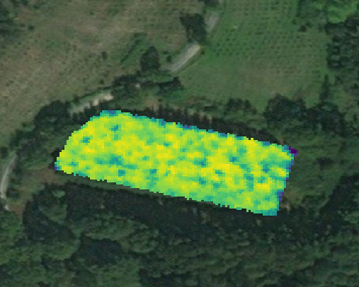

```{r setup, include=FALSE}
library(icon)
library(magrittr)
library(flextable)
```


class: title-slide  

# Supporting Ecological Decision Making Using Feature-Selection and Variable Importance

<html><div style='float:left'></div><hr color='#EB811B' size=1px width=796px></html>

### Patrick Schratz<sup>1</sup>
### .f25[and Jannes Muenchow<sup>1</sup>, Eugenia Iturritxa<sup>3</sup>, José Cortés<sup>1</sup>, Bernd Bischl<sup>2</sup>, Alexander Brenning<sup>1</sup>]

<p style="margin-left:15px;">

<br>

ISEM 2019, October 4th 2019, Salzburg, Austria

<br><br>

`r fa_university()` <sup>1 </sup> Department of Geography, GIScience group, University of Jena  <a href="https://www.geographie.uni-jena.de/Geoinformatik.html">`r fa_external_link_alt()`</a>  
<br>
`r fa_university()` <sup>2</sup> NEIKER, Vitoria-Gasteiz, Spain <a href="http://www.neiker.net/">`r fa_external_link_alt()`</a>
<br>
`r fa_university()` <sup>3</sup> Department of Statistics, Comp. Statistics group, LMU Munich  <a href="https://www.compstat.statistik.uni-muenchen.de/">`r fa_external_link_alt()`</a>
<br>

<br><br>

`r fa_home()` <a href="https://pjs-web.de">https://pjs-web.de</a> &emsp; 

`r fa_twitter()` <a href="https://twitter.com/pjs_228">@pjs_228</a> &emsp; 

`r fa_github()` <a href="https://github.com/pat-s">@pat-s</a> &emsp; 

</p>

---

layout: true

.footer[
slides: kutt.it/ISEM 
]

---

### About me

.pull-left[

```{r, echo = FALSE}
knitr::include_graphics("https://pjs-web.de/authors/admin/avatar_hud979e34f5123fec6163cd5fb1cb16697_143342_250x250_fill_q75_box_center.jpg")
```

- M.Sc. Geoinformatics
- Researcher at University of **Jena** and **LMU Munich**
- PhD Candidate

]

.pull-right[
- Unix & R enthusiast
- Machine learning in R ([mlr3](https://github.com/mlr-org/mlr3), [mlr](https://github.com/mlr-org/mlr))

```{r, echo = FALSE}
knitr::include_graphics("https://raw.githubusercontent.com/mlr-org/mlr/master/man/figures/logo_navbar.png")
```

### Personal focus

- Open-source software
- Reproducible research
- High-performance computing
- AUR package maintainer

]


---

# Study Objectives

- Relate **defoliation** at trees to remote-sensing information 
  - raw band information
  - vegetation indices
  - normalized ration indices
  
- Evaluate various (machine/statistical)-learning methods on **predictive performance**

- Compare **dimension-reduction** methods (simple filters, ensemble filters, PCA)

- Analyze the effect of **combined feature sets**

- Which spectral regions/variables are **most important** for modeling defoliation?


---

class: inverse, center, middle

.big-inv[
Study Design
]

---

# Workflow

- Usage of the **R** programming language

- Completely **reproducible**

- "makefile" approach using the DSL of the .pkg[drake] package

- Model fitting/evaluation via the .pkg[mlr] package (machine learning framework in R)

- Research compendioum on [Github](https://github.com/pat-s/2019-feature-selection) and [Zenodo](https://zenodo.org/record/2633102)

---

# Defoliation

```{r, echo = FALSE}
knitr::include_graphics("https://raw.githubusercontent.com/pat-s/2019-feature-selection/master/code/98-paper/ieee/jpg/defol-grid-pres-1500px.jpg")
```

.large[
&emsp; 10 % &emsp;&emsp;&emsp; 20 %  &emsp;&emsp;&emsp; 40%  &emsp;&emsp; 60-70%
]

Caused by pathogens

.flex[
.w50.ph4[
- _Armillaria mellea_
- _Diplodia sapinea_
]
.w50[
- _Fusarium circinatum_
- _Heterobasidion annosum_
]
]

---

<center></center>

---

# Hyperspectral Data

.pull-left[
- 122 bands

- Band width: ~ 4 nm

- Wavelength range: 400 - 1000 nm

- Acquisition date: September 2016
]

.pull-right[
<center></center>

<center>NDVI of Laukiz 1</center>
]

---

# Feature Set Creation

- Extraction of hyperspectral reflectances for each tree using a buffer of **two meters**

- Calculation of **90** vegetation indices

- Calculation of all possible "normalized ration indices" (NRI): **7470**

  $NRIᵢⱼ = \frac{bᵢ - bⱼ}{bᵢ + bⱼ}$
  
<hr>

.pull-left[
- **HR** (hyperspectral reflectances)

- **VI** (vegetation indices)

- **NRI** (normalized ratio indices)
]

.pull-right[
- **HR** + **VI**

- **HR** + **NRI**

- **HR** + **VI** + **NRI**
]

---

# Benchmark Setup

.flex[
.w50.ph0[

## Models

**Machine learning**

- Support Vector Machine (SVM)

- Random Forest (RF)

- Extreme Gradient Boosting (XGBoost)

**Statistical**

- L1 penalized regression (LASSO)
- L2 penalized regression (RIDGE)
]

.w50.ph0[

## Filters

- (PCA)

- Borda (Ensemble)

- Carscore

- Conditional mutual information criterion

- Information Gain

- Pearson correlation

- Relief
]
]

---

  # Benchmark Setup

.flex[
.w40.ph2[
## Hyperparameter optimization

- Model-based optimization (Bayesian)

  - Initial budget: 30
  - Sequential budget: 70

- Tuning of $p$ (number of variables) during parameter optimization

- Penalized methods: Optimization of penalization term $s$

]

.w50.ph0[

## Error Measure

Root Mean Square Error (RMSE)

## Resampling Strategy

 Nested 4-fold **spatial cross-validation** (plot-based)
]
]

---

class: inverse, center, middle

.big-inv[
Results
]

---

.flex[
.w-65.br0.mr4[

<center></center>

]

.w-30[

## First look

- ML > statistical?

- Not much difference between tasks

- Substantial differences between models

- RMSE ~ 34

]]

`r icon::fa_arrow_right()` Too much information for a single presentation slide


---

.flex[
.w-50.mr3[

```{r, echo = FALSE}
readRDS(url("https://github.com/pat-s/2019-feature-selection/raw/master/code/98-paper/presentation/table-perf.rda"))[1:15,] %>% 
  flextable() %>% 
  fontsize(size = 18, part = "all") %>% 
  color(i = 1, color = "red")
```

<div style="height:40px;font-size:2px;">&nbsp;</div>

<center> Best 15 absolute scores </center>
]

.w-60[
```{r, echo = FALSE}
readRDS(url("https://github.com/pat-s/2019-feature-selection/raw/master/code/98-paper/presentation/table-best-learner-per-task.rda")) %>% 
  flextable::flextable() %>% 
    fontsize(size = 15, part = "all")
```

<div style="height:40px;font-size:2px;">&nbsp;</div>

<center> Best scores by learners across all tasks/filters </center>

]
]

---

# Intermediate Summary

`r icon::fa_arrow_right()` No practical difference between most learners regarding their overall performance

`r icon::fa_arrow_right()` Combination of feature sets does not substantially increase performance

`r icon::fa_arrow_right()` HS reflectance values result in almost similar performance than using indices

---

class: center, middle

.big-q[
What about the filter differences?
]

---

class: center, middle

.big-q[
Effect of filter methods in general (1/3)
]

---

class: center

<center></center>

Model performances in RMSE when using **no filter** method compared to the **best scoring filter** method for each learner across all tasks

---

class: center, middle

.big-q[
Effect of ensemble filters (2/3)
]

---
class: center, middle

<center></center>

Model performances in RMSE when using the **ensemble** "Borda" filter method compared to the **best scoring filter** method for each learner across all tasks

---

class: center, middle

.big-q[
Effect of filtering by model (3/3)
]

---
class: center, middle

<center></center>

Model performances in RMSE of **all used filter methods** and PCA for each learner across all tasks

---

# Summary

- Almost no effect of filters for SVM

- **Effect** of filters **differs** across tasks and models (no clear pattern)

- **Ensemble filters** showed **no improvement** in predictive performance compared to simple filters in this study

- **Statistical models** (i.e. Ridge) are able to reach **similar performance** as ML models in high-dim settings

- PCA is a valid alternative to filter methods

---

class: center, middle

.big-q[
Which features are most important for predicting **defoliation**?
]

---

## Which features are most important for predicting **defoliation**?

<center></center>

`r fa_arrow_right()` Paper will be submitted soon

`r fa_arrow_right()` Idea: Relate most important variables (permutation-based VarImp) to spectral regions

.img-credit[img credit https://pogomonster.files.wordpress.com/2014/08/work-in-progress-sign.png]

```{r xaringan-themer, include = FALSE, eval = FALSE}
options(htmltools.dir.version = FALSE)
library(icon)
library(xaringanthemer)
library(magrittr)
library(flextable)
solarized_light(
  outfile = here::here("2019-10-ISEM/assets/css/xaringan.css"),
  header_font_google = google_font("Josefin Sans"),
  text_font_google   = google_font("Montserrat", "500", "400i"),
  code_font_google   = google_font("Droid Mono"),
  title_slide_background_color = "white",
  link_color = "#eb1455",
  text_bold_color = "#00589a",
  text_font_size = "25px",
  header_color = "#002733",
  padding = "1em 2em 1em 2em"
)
extra_css = list(
  ".remark-slide-content h1" = list(
    "margin-top" = "5px",
    "margin-bottom" = "5px"
  ),
  ".pull-left h1 h2 h3" = list(
    "margin-top" = "5px"
  ),
  ".h2nm" = list(
    "font-size" = "45px",
    "margin" = "0px",
    "color" = "black"
  ),
  ".h1sm" = list(
    "margin" = "5px",
    "font-size" = "55px",
    "color" = "black"
  ),
  ".title-slide" = list(
    "background-image" = "url(https://upload.wikimedia.org/wikipedia/commons/thumb/1/19/Uni-Jena-logo.svg/1200px-Uni-Jena-logo.svg.png)",
    "background-repeat" = "no-repeat",
    "background-size" = "150px",
    "background-position" = "bottom right",
    "background-color" = "#fdf6e3",
    "font-color" = "black"
  ),
  ".title-slide > h3" = list(
    "color" = "black"
  ),
  ".f25" = list(
    "font-size" = "25px"
  ),
  ".footer" = list(
    "position" = "absolute",
    "left" = "10px",
    "bottom" = "0",
    "width" = "100%",
    "color" = "black",
    "font-size" = "12px",
    "line-height" = "0px",
    "font-style" = "italic",
    "text-align" = "start"
  ),
  ".img-credit" = list(
    "position" = "absolute",
    "font-size" = "0.4em",
    "text-align" = "center",
    "width" = "100%"
  )
)
write_extra_css(extra_css, here::here("2019-10-ISEM/assets/css/extra.css"))
```
