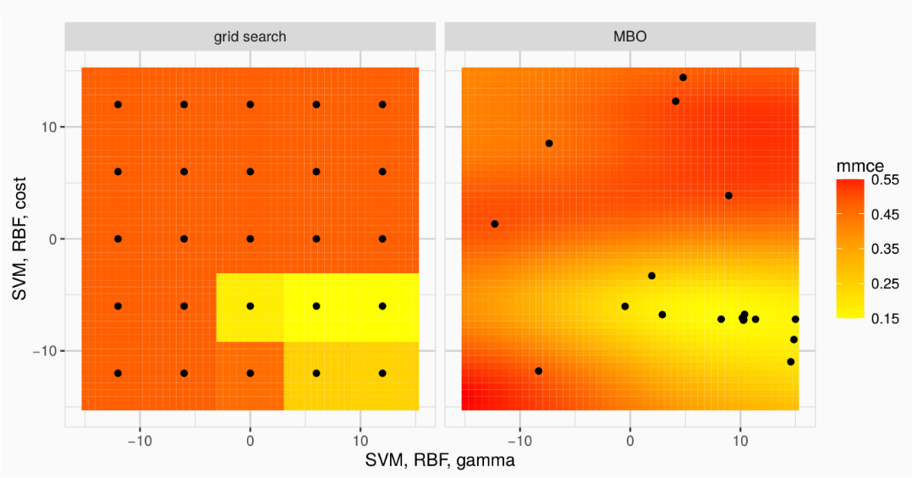

```{r setup, include=FALSE}
library(icon)
library(magrittr)
library(flextable)
```


class: title-slide  

# Supporting Ecological Decision Making Using Feature-Selection and Variable Importance

<html><div style='float:left'></div><hr color='#EB811B' size=1px width=796px></html>

### Patrick Schratz<sup>1,3</sup>

## and Jannes Muenchow<sup>1</sup>, Eugenia Iturritxa<sup>2</sup>, José Cortés<sup>1</sup>, Bernd Bischl<sup>3</sup>, Alexander Brenning<sup>1</sup>

<p style="margin-left:15px;">

.f20[
Kolloquium, December 10th 2019, Münster, Germany
]

<br>

.f15[

`r fa_university()` <sup>1 </sup> Department of Geography, GIScience group, _University of Jena_

`r fa_university()` <sup>2</sup> _NEIKER_, Vitoria-Gasteiz, Spain

`r fa_university()` <sup>3</sup> Department of Statistics, Comp. Statistics group, _LMU Munich_

<br><br>

`r fa_home()` <a href="https://pat-s.me">pat-s.me</a> &emsp; 
`r fa_twitter()` <a href="https://twitter.com/pjs_228">@pjs_228</a> &emsp; 
`r fa_github()` <a href="https://github.com/pat-s">@pat-s</a> &emsp; 

</p>

]

---

layout: true

.slide-link[
<a href="https://slides.pat-s.me/19-12-MS">slides.pat-s.me/19-12-MS</a>
]

---

# About me

.pull-left[

```{r, echo = FALSE, dpi=180}
knitr::include_graphics("img/ich.jpg")
```

- M.Sc. Geoinformatics
- Researcher at University of **Jena** and LMU **Munich**
- PhD Candidate

]

.pull-right[
- Unix & R enthusiast
- Machine learning in R ([mlr3](https://github.com/mlr-org/mlr3), [mlr](https://github.com/mlr-org/mlr))

```{r, echo = FALSE}

```

### Personal focus

- Open-source software
- Reproducible research
- High-performance computing
- AUR package maintainer

]

---

class: inverse, center, middle

# 1. Study Design

---

# Defoliation

```{r, echo = FALSE}
knitr::include_graphics("https://raw.githubusercontent.com/pat-s/2019-feature-selection/master/code/98-paper/ieee/jpg/defol-grid-pres-1500px.jpg")
```

.large[
&emsp;&emsp; 10 % &emsp;&emsp;&emsp;&emsp;&emsp;&emsp; 20 %  &emsp;&emsp;&emsp;&emsp;&emsp;&emsp; 40%  &emsp;&emsp;&emsp;&emsp;&emsp; 60-70%
]

Caused by pathogens:

.flex[
.w50.ph4[
- _Armillaria mellea_
- _Diplodia sapinea_
]
.w50[
- _Fusarium circinatum_
- _Heterobasidion annosum_
]
]

---

# Study Objectives

- Relate **defoliation** of trees to remote-sensing information using feature sets:
  - Raw band information
  - Vegetation indices
  - Normalized ration indices
  
- Evaluate various (machine/statistical)-learning methods on **predictive performance**

- Compare **dimension-reduction** methods (filter methods, PCA)

- Analyze the effect when **combining feature sets**

- **Feature importance**: Which spectral regions/variables stand out?


---

# Workflow

- Usage of the `r fa_r_project()` programming language.

- Completely **reproducible**.

- Domain-specific "makefile" approach via package .pkg[drake].

- Model fitting/evaluation via package .pkg[mlr] (machine learning framework in `r fa_r_project()`).

- Research compendium on [Github](https://github.com/pat-s/2019-feature-selection) and [Zenodo](https://zenodo.org/record/2633102).

---

<center></center>

---

# Response distribution

- 0 % - 100 %
- n = 1759

<center></center>

---


# Hyperspectral Data

.pull-left[
- 122 bands

- Band width: ~ 4 nm

- Wavelength range: 400 - 1000 nm

- Acquisition date: September 2016
]

.pull-right[
<center></center>

<center>NDVI of Laukiz 1</center>
]

---

# Feature Set Creation

- Extraction of hyperspectral reflectances for each tree using a buffer of **two meters**

- Calculation of **90** vegetation indices

- Calculation of all possible "normalized ration indices" (NRI): **7470**

  $NRIᵢⱼ = \frac{bᵢ - bⱼ}{bᵢ + bⱼ}$
  
<hr>

.pull-left[
- **HR** (hyperspectral reflectances)

- **VI** (vegetation indices)

- **NRI** (normalized ratio indices)
]

.pull-right[
- **HR** + **VI**

- **HR** + **NRI**

- **HR** + **VI** + **NRI**
]

---

# Benchmark Setup

.flex[
.w50.ph0[

## Models

**Machine learning**

- Support Vector Machine (SVM)

- Random Forest (RF)

- Extreme Gradient Boosting (XGBoost)

**Statistical**

- L1 penalized regression (LASSO)
- L2 penalized regression (RIDGE)
]

.w50.ph0[

## Filters

- (PCA)

- Borda (Ensemble)

- Carscore

- Conditional mutual information criterion

- Information Gain

- Pearson correlation

- Relief
]
]

---

  # Benchmark Setup

.flex[
.w40.ph2[
## Hyperparameter optimization

- Model-based optimization (Bayesian)

  - Initial budget: 30
  - Sequential budget: 70

- Tuning of $p$ (number of variables) during parameter optimization

- Penalized methods: Optimization of penalization term $s$

]

.w50.ph0[

## Error Measure

Root Mean Square Error (RMSE)

$RMSE = \sqrt{\frac{1}{n}\Sigma_{i=1}^{n}{\Big(\frac{d_i -f_i}{\sigma_i}\Big)^2}}$

## Resampling Strategy

 Nested 4-fold **spatial cross-validation** (plot-based)
]
]

---

class: inverse, center, middle

# 2. Results

---

.flex[
.w-65.br0.mr4[

<center></center>

]

.w-30[

## First look

.f20[

- ML > statistical?

- Not much difference between feature sets

- Substantial differences between models

- RMSE ~ 31

]]]

`r icon::fa_arrow_right()` Too much information


---

.flex[
.w-50.mr3[

```{r, echo = FALSE}
readRDS(url("https://github.com/pat-s/2019-feature-selection/raw/master/code/98-paper/presentation/table-perf.rda"))[1:15, ] %>%
  flextable() %>%
  fontsize(size = 14, part = "all") %>%
  color(i = 1, color = "red") %>%
  autofit()
```

<div style="height:40px;font-size:2px;">&nbsp;</div>

<center> Best 15 absolute scores </center>
]

.w-60[
```{r, echo = FALSE}
readRDS(url("https://github.com/pat-s/2019-feature-selection/raw/master/code/98-paper/presentation/table-best-learner-per-task.rda")) %>%
  flextable() %>%
  fontsize(size = 15, part = "all") %>%
  autofit()
```

<div style="height:40px;font-size:2px;">&nbsp;</div>

<center> Best scores by learners across all tasks/filters </center>

]
]

---

# Intermediate Summary

`r icon::fa_arrow_right()` No practical difference between most learners regarding their overall performance

--

`r icon::fa_arrow_right()` Combination of feature sets does not substantially increase performance

--

`r icon::fa_arrow_right()` HS reflectance values only show the best performance for most models

--

`r icon::fa_arrow_right()` MBO optimization does not work well for Lasso and Ridge implementations here

---

class: center, middle

# What about the filter differences?

---

class: center, middle

# 2.1 Effect of filter methods in general (1/3)

---

class: center

<center></center>

Model performances in RMSE when using **no filter** method compared to **any filter** method for each learner across all tasks

---

class: center, middle

# 2.2 Effect of ensemble filters (2/3)

---
class: center, middle

<center></center>

Model performances in RMSE when using the **ensemble** "Borda" filter method compared to the **best scoring filter** method for each learner across all tasks

---

class: center, middle

# 2.3 Effect of filtering by model (3/3)

---
class: center, middle

<center></center>

Model performances in RMSE when using **no filter** method compared to **any filter** method for each learner across all tasks

---

class: center, middle

# 3. Summary

---

# Summary

- Almost no effect of filters for SVM.

- **Effect** of filters **differs** across tasks and models (no clear pattern).

- **Ensemble filters** showed **no substantial improvement** in predictive performance compared to simple filters in this study.

- **Statistical models** (i.e. Ridge) are able to reach **similar performance** as ML models in high-dim settings.

- What about PCA?

---

class: center, middle

# 4. Which _single features_ are most important for predicting **defoliation**?

---

## Which features are most important for predicting **defoliation**?

<center></center>

`r fa_arrow_right()` All feature importance approaches struggle with highly-correlated datasets

`r fa_arrow_right()` Least problematic: "Accumulated Local Effects" (ALE) plots

.img-credit[img credit https://pogomonster.files.wordpress.com/2014/08/work-in-progress-sign.png]

---

# ALE plots

**Partial Dependence Plots**

.f20[
  > See what the model predicts on average when each data instance has the **value `v` for feature X**, igoring whether `v` makes sense for all data instances.
]

**Marginal-Plots**

.f20[
  > See what the model predicts on average for data instances that have values **close to `v` for feature X**. The effect could be due to that feature, but also due to correlated features.
]


**ALE plots**

.f20[
> See how the model predictions change in a **small ”window" of the feature around `v`** for data instances in that window.
]


<br>
.f15[
Source: https://christophm.github.io/interpretable-ml-book/ale.html
]

---


class: center, middle

# Backup

---

# MBO tuning

```{r animation, message = FALSE, warning = FALSE, echo=FALSE, eval=TRUE, fig.width=9, fig.height=4, animation.hook='gifski', cache=TRUE, fig.align='center'}
library(mlrMBO)
set.seed(2)
library(ggplot2)
library(mlrMBO)
library(animation)
configureMlr(show.learner.output = FALSE)
pause = interactive()
set.seed(1)
fn = makeCosineMixtureFunction(1)
obj.fun = convertToMinimization(fn)
# mbo control with defaults
ctrl = makeMBOControl()
ctrl = setMBOControlTermination(ctrl, iters = 10L)
ctrl = setMBOControlInfill(ctrl, crit = makeMBOInfillCritEI(), opt = "focussearch", opt.focussearch.points = 500L, opt.restarts = 1L)
design = generateDesign(5L, getParamSet(obj.fun), fun = lhs::maximinLHS)
run = exampleRun(obj.fun, design = design,
  control = ctrl, points.per.dim = 1000, show.info = TRUE)
for(i in 1:10) {
  plotExampleRun(run, iters = i, pause = pause, densregion = TRUE, gg.objects = list(ggpubr::theme_pubr()))
}
```

**Upper:** The surrogate model (black, dashed) models the unknown relationship between input/output (black, solid) based on the initial design (red points).

**Lower**: Mean and variance of the surrogate model (by default a kriging learner) is used to derive the expected improvement criterion (EI). The point which maximizes this is proposed (blue point).

---

# MBO tuning

<center></center>

.f15[
1. Fit a surrogate model

2. Propose new hyperparameter configuration based on the EI

3. Evaluate performance and update the design
]

.f20[
`r fa_arrow_right()` Allows searching in more promising areas rathern than covering the complete space.

`r fa_arrow_right()` Can save a lot of time, especially when the search space is large.

]


---

# Borda filter

- "FSelectorRcpp_information.gain"
- "linear.correlation"
- "praznik_MRMR"
- "praznik_CMIM"
- "carscore"
- "FSelector_relief"

```{r xaringan-themer, include = FALSE, eval = FALSE}
options(htmltools.dir.version = FALSE)
library(icon)
library(xaringanthemer)
library(magrittr)
library(flextable)
mono_light(
  base_color = "#002350",
  outfile = here::here("2019-12-muenster/assets/css/xaringan.css"),
  header_font_google = google_font("Josefin Sans"),
  text_font_google = google_font("Montserrat", "500", "400i"),
  code_font_google = google_font("IBM Plex Mono", "300", "400"),
  title_slide_text_color = "white",
  link_color = "#eb811b",
  text_bold_color = "#00589a",
  text_font_size = "25px",
  header_color = "#002733",
  padding = "1em 2em 1em 2em"
)
extra_css <- list(
  ".remark-slide-content h1" = list(
    "margin-top" = "5px",
    "margin-bottom" = "5px"
  ),
  ".pull-left h1 h2 h3" = list(
    "margin-top" = "5px"
  ),
  ".h2nm" = list(
    "font-size" = "45px",
    "margin" = "0px",
    "color" = "black"
  ),
  ".h1sm" = list(
    "margin" = "5px",
    "font-size" = "55px",
    "color" = "black"
  ),
  ".title-slide" = list(
    "background-image" = "img/fsu-logo.eps",
    "background-repeat" = "no-repeat",
    "background-size" = "120px",
    "background-position-x" = "right",
    "background-position-y" = "99%"
  ),
  ".title-slide > h1 > h2 > h3 > .f25 " = list(
    "color" = "white"
  ),
  ".title-slide > h1" = list(
    "margin-top" = "-10px"
  ),
  ".title-slide > h2" = list(
    "margin-top" = "-10px",
    "font-size" = "25px"
  ),
  ".f25" = list(
    "font-size" = "25px"
  ),
  ".f20" = list(
    "font-size" = "20px"
  ),
  ".f15" = list(
    "font-size" = "15px"
  ),
  ".big-inv" = list(
    "font-size" = "55px"
  ),
  ".slide-link" = list(
    "position" = "absolute",
    "left" = "3px",
    "bottom" = "0px",
    "width" = "max-content",
    "color" = "#002b36",
    "font-size" = "12px",
    "line-height" = "0px",
    "font-style" = "bold italic",
    "text-align" = "start"
  ),
  ".img-credit" = list(
    "position" = "absolute",
    "font-size" = "0.4em",
    "text-align" = "center",
    "width" = "100%"
  ),
  ".pkg" = list(
    "color"             = "black",
    "font-weight"       = 400,
    "font-size"         = "95%",
    "font-family"       = "IBM Plex Mono",
    "padding"           = "1px 4px",
    "background-color"  = "#f6f8fa",
    "border-radius"     = "4px",
    "border"            = "1px solid #82c878"
  )
)
write_extra_css(extra_css, here::here("2019-12-muenster/assets/css/extra.css"),
  append = FALSE
)
```
